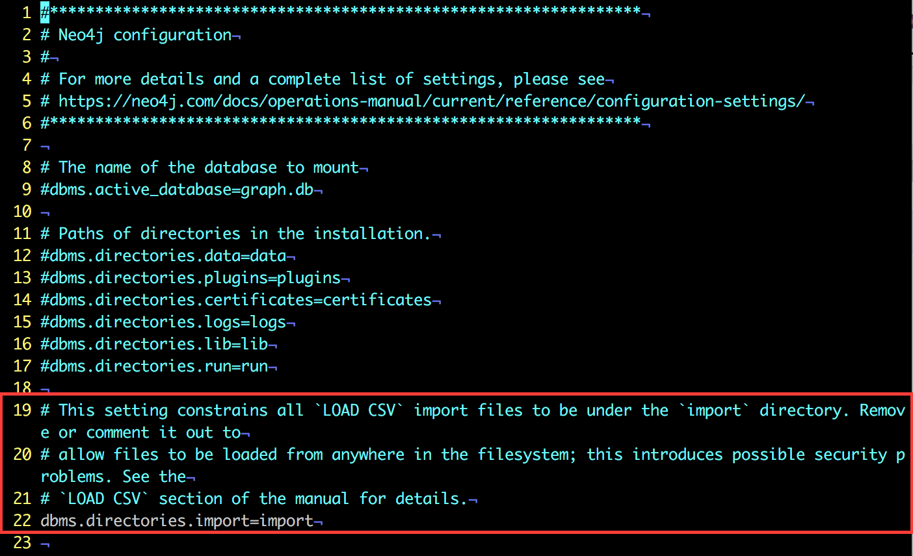

neo4j 相关笔记
=============

脚本工具
-------

安装依赖：

	$ pip install requirements.txt

### generate\_cypher\_from\_csv\_file.py

读取从 MySQL 导出的表 csv 文件（需要带header），生成 cypher 语句。

	# -f <filename>，支持相对路径，绝对路径
	$ python generate_cypher_from_csv_file.py -f "/path/to/table_name.csv"

	# -c 自动保存结果到剪切板
	$ python generate_cypher_from_csv_file.py -f "/path/to/table_name.csv" -c

遇到的问题
---------

### 从本地 load csv 文件

**Q:** 尝试 `load csv from file:///Users/username/.../data.csv`，提示 `Couldn't load the external resource at: file:/usr/local/Cellar/neo4j/3.2.0/libexec/import/Users/username/.../data.csv`

版本：`macOS Sierra 10.12.5`, `neo4j 3.2.0` 

**A:** 看起来是从固定目录导入，可以把数据放在 neo4j import 目录中，再load csv。

或者：

[StackOverflow: Cypher Neo4j Couldn't load the external resource](https://stackoverflow.com/questions/28398778/cypher-neo4j-couldnt-load-the-external-resource)

### 最长的 path; longest path

* [neo4j.com: Achieving longestPath Using Cypher](https://neo4j.com/developer/kb/achieving-longestpath-using-cypher/)

		MATCH p=(parent:Entity)-[r:HAS_CHILD*1..10]->(child:Person)
		RETURN p;

	and 

		MATCH p=(parent:Entity)-[r:HAS_CHILD*1..10]->(child:Person)
		WHERE size( (child)-[r:HAS_CHILD]->() ) = 0
		RETURN p;

* `match p=()-[rel:RELATION]-() return p order by length(p) desc limit 1`

* 来自 [StackOverflow:how to find all the longest paths with cypher query?](https://stackoverflow.com/questions/19764527/how-to-find-all-the-longest-paths-with-cypher-query):

		START n=node(*)
		MATCH p=n-[rels:INCLUDE*]->m 
		WHERE ALL (rel IN rels 
			WHERE rel.status='on') 
		WITH COLLECT(p) AS paths, MAX(length(p)) AS maxLength 
		RETURN FILTER(path IN paths 
			WHERE length(path)= maxLength) AS longestPaths

Interesting Links
-----------------

* [The Graph of Programming Languages](http://neo4j.com/graphgist/7943148)
* [[github: neo4j-contrib/graphgist] GraphGist wiki](https://github.com/neo4j-contrib/graphgist/wiki)

开源工具
-------

* [A Command Line Interface for Neo4j's Cypher.](https://github.com/nicolewhite/cycli): 类似 [mycli](https://github.com/dbcli/mycli/)

文档链接
-------

* [Neo4j Cypher Refcard](https://neo4j.com/docs/cypher-refcard/current/)
* <https://neo4j.com/docs/developer-manual/current/cypher/>

Articles
--------

* [Neo4j 2.0: A Giant Leap For Graphkind](https://www.safaribooksonline.com/blog/2013/11/22/neo4j-2-0-a-giant-leap-for-graphkind/)
* [indexing in Neo4j – an overview](http://blog.armbruster-it.de/2013/12/indexing-in-neo4j-an-overview/)
